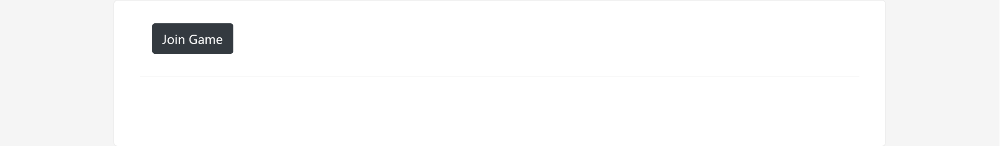
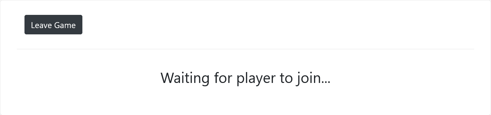
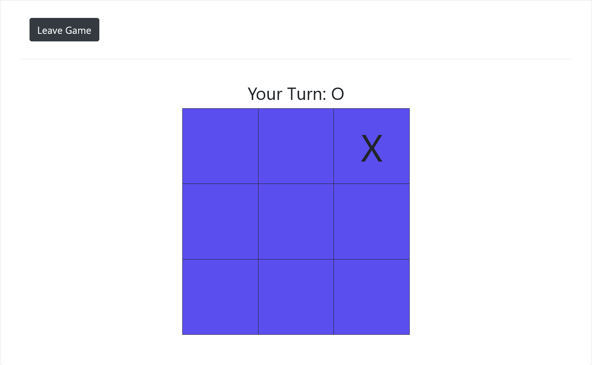

# Projekt

Simples Tic Tac Toe Spiel, das mit anderen im Browser gespielt werden kann.
## Beschreibung
Tic Tac Toe Spiel, mit den folgenden Eigenschaften
- Zwei Spieler können über den Browser gegeneinander spielen.
- Es gibt eine einfache Spielersuche. Ist kein volles Spiel verfügbar, so wird ein Raum eröffnet in dem gewartet wird, bis ein weiterer Spieler beitritt.
- Während des Spiels wird angezeigt, wer an der Reihe ist und welche Zuweisung (X/O) er hat.
- Am Ende des Spiels wird der Gewinner bekanntgegeben, falls er existiert.
- Das Spiel kann neu gestartet werden.
- Darüber hinaus kann zu jedem Zeitpunkt das Spiel verlassen werden. Der andere Spieler bleibt im Raum und wartet, bis ein neuer Spieler beitritt.

Mögliche Erweiterungen
- Spieler können Namen und (X/O) festlegen.

### Spiel Beitreten


### Auf Spieler warten


### Spiel


### Spiel vorbei


## Verwendete Technologien
- Spring Boot
    - Web Socket
- HTML
- CSS
- JavaScript

## Getting Started

### Dependencies

* Describe any prerequisites, libraries, OS version, etc., needed before installing program.
* ex. Windows 10

### Installing

* How/where to download your program
* Any modifications needed to be made to files/folders

### Executing program

* How to run the program
* Step-by-step bullets
```  
code blocks for commands  
```  


